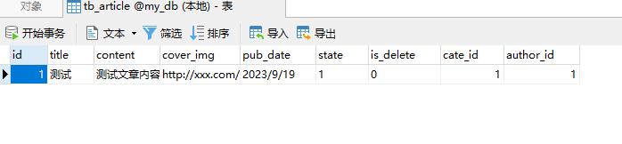
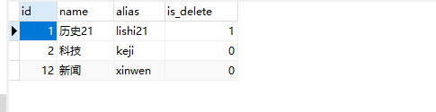
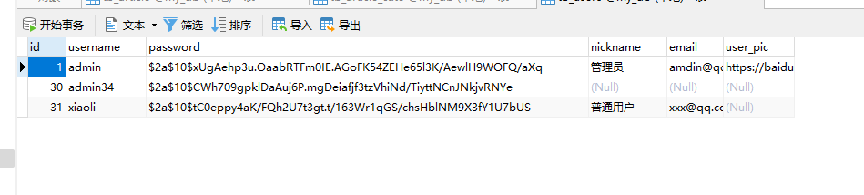

# node搭建接口项目

## 环境 
node 18+

## 依赖
```sh
"bcryptjs": "^2.4.3",
"cors": "^2.8.5",
"express": "^4.18.2",
"express-jwt": "^5.3.3",
"jsonwebtoken": "^9.0.2",
"mysql": "^2.18.1"

// express-jwt版本要用5.3.3不然会验证token的时候会报错

```

## 主要实现功能

#### 用户模块

用户登录<br> 
用户注册<br> 
查询用户信息<br> 
更新用户信息<br> 
重置用户密码<br> 
更换用户头像<br> 

#### 文章分类模块
获取文章分类<br> 
添加分类<br>
根据id删除分类<br>
根据id获取分类<br>
根据id跟新分类<br>

#### 文章模块
获取所有文章信息<br>
添加文章<br>
删除文章<br>

#### 数据表
文章数据表

<br>
文章分类数据表

<br>
用户数据表


### 安装

```sh
npm install
```


### 运行

```sh
node app.js
```

